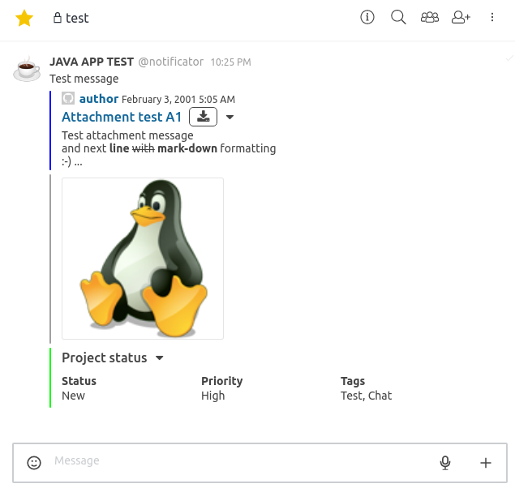

# Rocketchat modern client

[](https://travis-ci.org/daniel-sc/rocketchat-modern-client)
[](https://coveralls.io/github/daniel-sc/rocketchat-modern-client?branch=master)

This project aims to provide a simple java client for the [Rocket.Chat](https://rocket.chat) live chat api.
The current focus is on ease of usability and solid core functionality over complete method coverage (PRs always welcome!).

## Read first
Make sure you have at least some rough understanding of [CompletableFuture](https://docs.oracle.com/javase/8/docs/api/java/util/concurrent/CompletableFuture.html)
and [RxJava](https://github.com/ReactiveX/RxJava) as these are used heavily for the client api.

## Setup
Just include the client as Maven dependency in your `pom.xml` via:

```xml
<dependency>
    <groupId>com.github.daniel-sc</groupId>
    <artifactId>rocketchat-modern-client</artifactId>
    <version>0.0.7</version>
</dependency>
```

## Usage

Get subscriptions/rooms:
```java
try(RocketChatClient client = new RocketChatClient("wss://open.rocket.chat:443/websocket", USERNAME, PASSWORD)) {
    List<Subscription> subscriptions = client.getSubscriptions().join();
}
```

Send message:
```java
try(RocketChatClient client = new RocketChatClient(URL, USERNAME, PASSWORD)) {
    ChatMessage msg = client.sendMessage("Your message", roomId).join();
}
```

Send message with alias and avatar:
```java
try(RocketChatClient client = new RocketChatClient(URL, USERNAME, PASSWORD)) {
    ChatMessage msg = client.sendMessageExtendedParams("Your message", roomId, "Alias", "https://goo.gl/8afu6d", null, null).join();
}
```


Send message with alias and emoji:
```java
try(RocketChatClient client = new RocketChatClient(URL, USERNAME, PASSWORD)) {
    ChatMessage msg = client.sendMessageExtendedParams("Your message", roomId, "Alias", null, ":e-mail:", null).join();
}
```

_If you send both avatar and emoji, rocket chat client show only avatar._
```
ChatMessage msg = client.sendMessageExtendedParams("Your message", roomId, "Alias", "https://goo.gl/8afu6d", ":e-mail:", null).join();
```

Update message:
```java
try(RocketChatClient client = new RocketChatClient(URL, USERNAME, PASSWORD)) {
    ChatMessage chatMessage = client.sendMessage("Your message", roomId).join();
    String edited = "~" + chatMessage.msg + "~"; // strikethrough original message
    new Scanner(System.in).nextLine(); // Wait ...
    ChatMessage editedMessage = client.updateMessage(edited, chatMessage._id).join();
}
```

Stream/read messages:
```java
try(RocketChatClient client = new RocketChatClient(URL, USERNAME, PASSWORD)) {
    Observable<ChatMessage> msgStream = client.streamRoomMessages(roomId).join();
    msgStream.forEach(msg -> System.out.println("received msg: " + msg));
    // block thread until you got enough messages.. (or don't use try-with and close client explicitly)
    msgStream.dispose();
}
```

Send message with _Attachments_ and _Attachment Fields_:
```java
try(RocketChatClient client = new RocketChatClient(URL, USERNAME, PASSWORD)) {
    List<Attachment> attachments = new ArrayList<Attachment>();

    Attachment a1 = new Attachment();        
    a1.color = "#0000ff";
    a1.iso8601Date = "2001-02-03T04:05:06.789Z";
    a1.text = "Test attachment message\nand next **line** ~~with~~ **mark-down** formatting\n:-) ...";
    a1.authorName = "author";
    a1.authorIcon = "https://avatars2.githubusercontent.com/u/0?s=400&v=4";
    a1.authorLink = "https://github.com/";
    a1.title = "Attachment test A1";
    a1.titleLink = "https://www.google.com/?q=Attachment%20test%20A1";
    attachments.add(a1);

    Attachment a2 = new Attachment();
    a2.imageUrl = "https://cdn3.iconfinder.com/data/icons/iconshock_developer/linux.png";        
    attachments.add(a2);
            
    Attachment a3 = new Attachment();
    a3.color = "#00FF00";
    a3.title = "Project status"; 
    List<AttachmentField> attachmentFields = new ArrayList<>();
    attachmentFields.add(new AttachmentField(true, "Status", "New"));
    attachmentFields.add(new AttachmentField(true, "Priority", "High"));    
    attachmentFields.add(new AttachmentField(true, "Tags", "Test, Chat"));
    a3.fields = attachmentFields;
    attachments.add(a3);
    ChatMessage msg = client.sendMessageExtendedParams(message, roomId, rcAlias, rcAvatar, rcEmoji, attachments).join();
}
```


## Websocket API
This client ships with [Tyrus](https://github.com/tyrus-project/tyrus)
websocket reference implementation.

If you like, you can replace the websocket library with any 
other JSR-356 compliant implementation of [WebSocket Server API](https://mvnrepository.com/artifact/javax.websocket/javax.websocket-api).
Just update your `pom.xml` as follows:
```xml
<dependency>
    <groupId>com.github.daniel-sc</groupId>
    <artifactId>rocketchat-modern-client</artifactId>
    <version>0.0.7</version>
    <exclusions>
        <exclusion>
            <groupId>org.glassfish.tyrus.bundles</groupId>
            <artifactId>tyrus-standalone-client-jdk</artifactId>
        </exclusion>
    </exclusions>
</dependency>
<dependency>
    <groupId>some.websocket-api.impl</groupId>
    <artifactId>some.websocket-api.impl</artifactId>
    <version>VERSION</version>
</dependency>
```

## Run integration tests
```bash
mvn clean install -Pintegration-test
```
